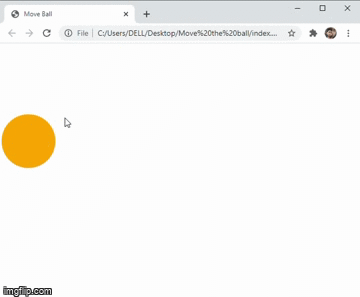

# Move-Ball
~~~
GIF
~~~

~~~
Controller keys:
~~~
* W - for moving in the upward direction
* A - for moving in the left direction
* S - for moving in the downward direction
* D - for moving in the right direction
